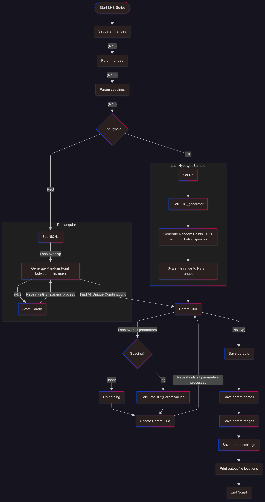
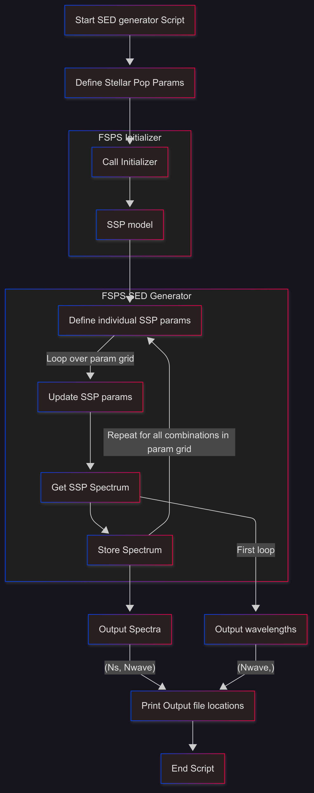
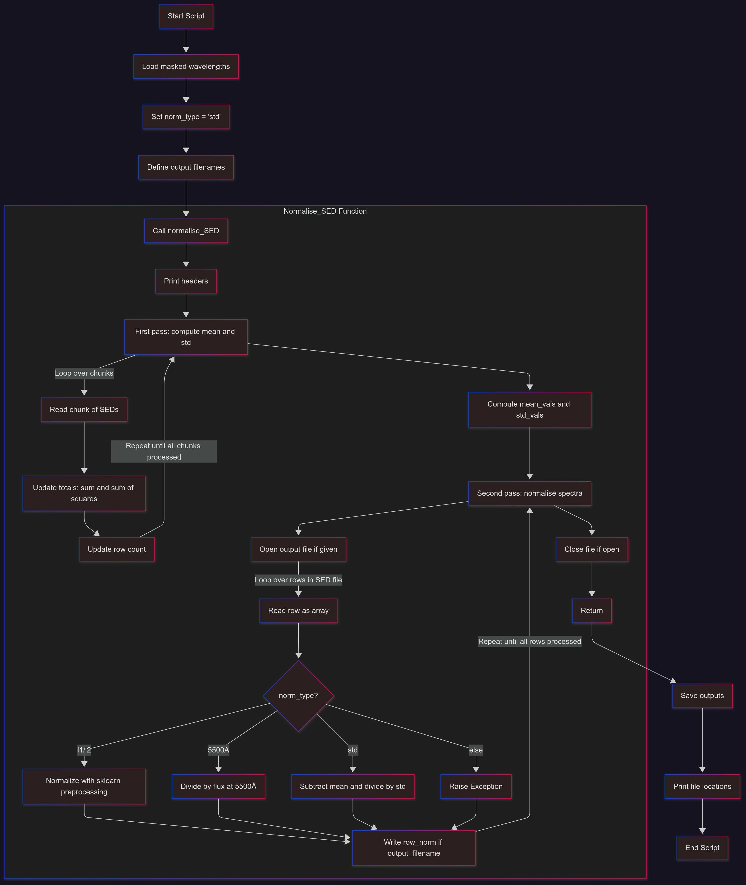
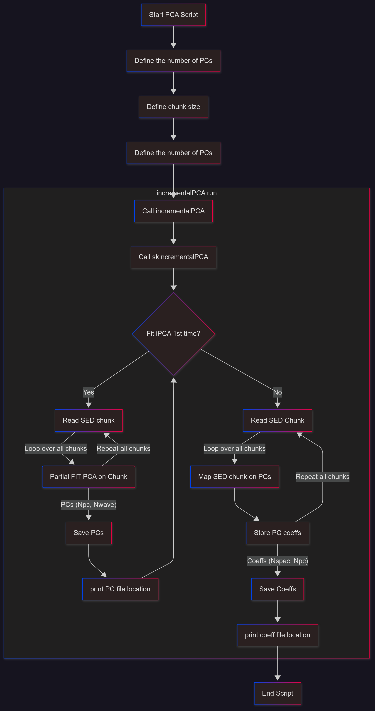

# PCA Spectra

## Table of contents
* [General info](#general-info)
* [Code structure](#code-structure)
* [Outputs](#outputs)
* [Scripts](#scripts)

## General info
This repository is for essential calculations for reconstruction of synthetic galaxy spectra using the Principal Component Analysis (PCA). Mainly, it makes use for the python-FSPS code for generating the simple stellar population (SSP) spectra

## Code structure
1. Use the Latin Hypercube Sampling method to generate the FSPS parameter grid, required for the SSP SED set.
2. Mask the SED to a specific redshift range essential for a given project (observation configurations)
3. Data preprocessing via L1, L2, 5500A, or Center&Standardise normalisation.
4. PCA application on the normalised SEDs.
5. SED reconstruction using the PC coefficients.

## Outputs
1. Mean Spectra
2. Scaling factor (From Step 3 above)
3. First N PCs (Obtains from step 4)
4. PC coefficients of each PC
5. SED interpolation using the PC coefficients 

## Scripts
1. Run the grid generator.
    ```
    $ python3 FSPS_param_grid_generator.py
    ``` 
    
2. Run the SED template generator.
    ``` 
    $ python3 FSPS_SED_template_generator.py
    ```
    
3. Run the masking step (by applying the wavelength selection) and the normalisation method (preprocessing for PCA).
    ``` 
    $ python3 FSPS_SED_normalisation.py    
    ```
    
4. Run the PCA on the normalised SEDs
    ```
    $ python3 incrementalPCA_run.py
    ```
    
5. Interpolate the SED to couple with the SFHs
